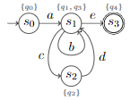
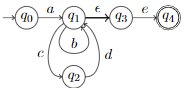
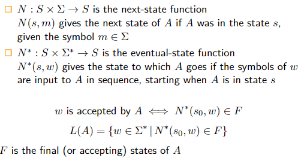

# Exam
The exam is a 30 minutes oral test with no preparation. The questions are known in advance and covers the curriculum.

The exam date is Monday November 16th

# Questions
## 1.1 Logic
- **Explain sentences: negation (not), conjunction (and), and disjunction (or), tautologies and contradictions**

Negation (not): 

Conjuntion (and):

Disjunction (or):

**T**autologies: Something that's always True `a = a`
**C**ontradictions: Something that can never be True `a ≠ a`

- **Explain truth tables**

- **Present some laws of logical equivalence including De Morgan’s law**

Commutative: order dosen't matter
Associative: calc order dosen't matter
Distributive: it distrubets the work.

proof of de morgans law

| $a$ | $b$ |  $¬a$ |  $¬b$ |  $(a ∧ b)$ | $¬(a ∧ b)$| $¬a ∨ ¬b$|
|---|---|---|---|---|---|---|
|  $false$ | $false$ |  $true$ | $true$  |  $false$ |  $true$ | $true$  |
|  $false$ |   $true$ |  $true$ | $false$  | $false$  |  $true$ |  $true$ |
|  $true$ | $false$  |  $false$ | $true$  |  $false$ |  $true$ | $true$  |
|  $true$|   $true$ | $false$  | $false$  |  $true$ |  $false$ | $false$  |

- **Explain conditional statements, their contrapositive, converse, and inverse, hypothesis and conclusion**

Conditional Statements:

if *hypothesis* then *conclusion*

You can also write it like this:

Contrapositive: 

The negation of a conditional statement

Converse:

Is where A and B are swapped in the original conditional statement

Inverse:

Is the negation of A and B in the original conditional statement

Converse is equivalent to Inverse
Contrapositive is equivalent to the original conditional statement

- **Explain arguments, modus ponens and modus tollens**

Argument

Modus Ponens = Method of Affirming:

Modus Tollens = Method of Denying:

## 1.2 Predicates and Quantified statements
- Define predicates and their truth sets

    - Domain *D = {1, 2, ... 8, 9}*
    - Set-Builder notation *{x ∈ D | x ≤ 5}*
    - Truth sets *{1, 2, 3, 4, 5}*
    
- Explain the universal and existential quantifiers

[universal conditional statements](https://www.csm.ornl.gov/~sheldon/ds/ans1.6.3.html)

- Present some arguments with quantified statements

- Present some laws of multi-quantified statements including De Morgan’s law

## 1.3 Sequences, Induction and Recursion
- Define a sequence

A **sequence** is a function whose **domain** is either all the integers between two given integers or all the integers greater than or equal to a given integer

1 ≤ n ≤ 8 : n2 = 1, 4, 9, . . . 64
Domain : Function = Result
Sequence

In other words, everything on the left of the equation is the sequence, and not the result.

**Propertiese:**

Sequences have a *start*.
Sequences have a *succ* fucntion (next).
The *succ* function is guarateed to reach every value in the sequence, exactly one time.
The sequence has an order.

- Explain summations and telescopic sums

telescopic: everything between the start and end is 0, there for we can colapse the sum like a telescope

- Explain products and theorems for working with sums and products

Adding and removing final term for summation and products

Other Theorems

- Explain factorials and combinations

**Factorial:**
5! = 1 * 2 * 3 * 4 * 5

**Combinations**

- Describe the induction principles

????

- Explain recursion

k! = k · (k − 1)!

In other words, we use a prev. term to calculate the current term. see picture above.

## 1.4 Regular Expressions and Finite-state Automata
- Distinguish languages types according to Chomsky

**Type-0** Turning-complete languages  
**Type-1** Context-sensitive languages
**Type-2** Context-free languages
**Type-3** Regular languages 

????

- Define “alphabet”, “string”, and “language”

Alphabet, is a **finite** set of characters 
*Σ ={f,n,o}*

String, is either a **finite** seqeuene of characters in Σ or the empty (null) string ε
*ε, f, ff, fff, fno, ..., oofno*

Length of string, is the number of characters in the string.
*len(ε) = 0, len('oofno') = 5*

Language *L over Σ* is a set of strings over Σ
*L = {on, off}*
the empty set Ø or {} is a formal language.

*Alphabets and strings Σ is an alphabet*
*Σn is all strings over Σ with the lenght n*
*Σ+ is all non-empty strings over Σ*

*Combination of languages*
*L = {lamp_, fridge_} and L′ = {on, off}*

*LL′: **Concatenation** of L and L′*
*LL′ = {xy | x ∈ L ∧ y∈ L′}*
*LL′={lamp_on, lamp_off, fridge_on, fridge_off}*

*L ∪ L′: **Union** of L and L′*
*L ∪ L′ = {x | x ∈ L ∨ x ∈ L′}*
*L ∪ L′ = {lamp_, fridge_, on, off}*

*L**: ***Kleene Closure** of L*
*L = {'lamp', 'fridge'}*
*L∗ = {ε, lamp, fridge, lamplamp, lampfridge, lamplampfridge, ...}*

- What is the Kleene closure of a language?

*Σ∗ is all strings over Σ- the Kleene closure of Σ*

Kleene closure is a formal language and can be defined as such

*L = {'lamp', 'fridge'}*
*L∗ = {ε, lamp, fridge, lamplamp, lampfridge, lamplampfridge, ...}*

- How are regular expressions defined?
*see [slide 12](https://datsoftlyngby.github.io/soft2020fall/resources/6bde8e7b-05-regex-handouts.pdf)*

Base: *are called terminal*
*Ø, ε, x | x ∈ Σ*

Recursion: *are called non-terminal*
r, s ∈ regular expression over Σ

(rs) - r concatened with s
(r|s) - r or s
(r*) - zero ore more *r∗ ∈ {ε, r, rr, rrr, ...}*

- Explain the parts of a finite-state automaton

A finite-state automaton consists of:
    1. a finite **input alphabet** Σ of input symbols
    2. a finite set of **states** *S*
    3. an **intial state** *s0, s0 ∈ S*
    4. a set of **final states** *F (accepting states)*
    5. a **next-state function** *N : S × Σ → S*

- Drawing A(B|CD)*E

Not that the above example is deterministic and the one below is non-deterministic... This is because of the ε.

- Define the eventual-state function

Compared to the **next-state function** it works on strings and not just characters

Eventual-state function tells you which of the characters in the string reaches an end-state.

- Explain the relation between regular languages and languages accepted by a finite-state automaton

????

## 1.5 Set Theory

- Define a set
- How can an ordered pair be defined using sets only?
- Explain the Cartesian product
- Define a relation and a function, what is the empty set and a powerset

????

- Define subsets and set equality
- Present some laws on sets

## 1.6 Relations
- Define a relation on a set
- Explain reflectivity, symmetry, and transitivity
- What is the relation defined by a partition?
- Explain antisymmetry and partial ordering of sets

Symetric, it goes both ways.
antisymmetric Should go both ways, and therefor be equal
Not-antisymmetric Should go both ways and NOT be equal

## 1.7 Static Analysis
- Explain static analysis and Hoare Logic in general
- Explain the ideas behind design by contract
- Present the general content of design by contract code
- Explain what Sound and Complete analysis are
- In general terms, explain the process of static analysis